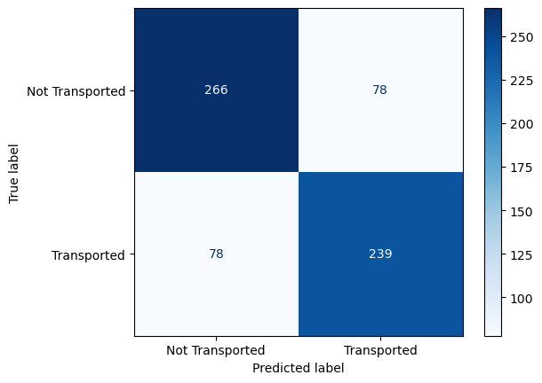

# KaggleSpaceTitanik

## Solution for kaggle contest https://www.kaggle.com/competitions/spaceship-titanic.

On kaggle: https://www.kaggle.com/code/gilsson/notebook6dd87c938f.

Score on submission: 0.79658.

After few tests and attemps, best result was with Gradient Boosting Classificator with params learning_rate=0.01, n_estimators=2000, max_depth=4.

